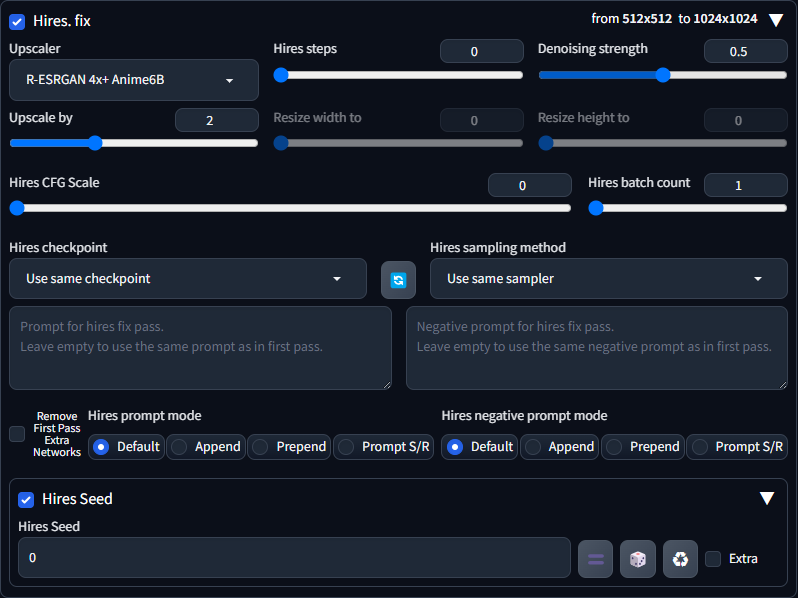

# sd webui hires fix tweaks

Add additional options and features to hires fix for [Stable Diffusion web UI](https://github.com/AUTOMATIC1111/stable-diffusion-webui)


## Features

1. Hires pass CFG scale
   - Set a different CFG scale for hires pass<br>this is particularly useful if you're working with LCM, can also a achieve interesting effects

2. Hires Batch and Seed
   - Generate multiple hires pass form first pass image
   - Specify different seed for hires pass

3. Hires prompt mode
   1. `Default`: Webui default behavior:<br>if blank same as first pass else use hires prompt
   2. `Append`: Append hires prompt after first pass prompt
   3. `Prepend`: Prepend hires prompt before first pass prompt
   4. `Prompt S/R`: Prompt Search and Replace:<br>replace or insert first pass prompt with hires prompt
   <br><br>
   - `Remove First Pass Extra Networks`: When check will remove extra networks from first pass prompt before creating hires prompt
4. Hires output directory
   - Specify a different output directory for hires pass
   - `Settings > Paths for saving > Output directory for hires. fix images`


## Remove First Pass Extra Networks
- `Remove First Pass Extra Networks` operates by removing all extra networks in prompt (every thin matching `<xxxx:extra-network-name:weight>`) in the first pass prompt, this means it only works with `LoRA` and `Hypernetworks` and dose not work with `Textual Inversion Embeddings` or if the extra networks are added by later by other means such as `Setting` or `Styles`.
- As it only touches the first pass prompt it will not have an affect if `Hires prompt mode` is `Default` and the hires prompt is not blank, as the user input hires prompt will take precedence. 
- - The default behavior of the webui is If `hires prompt is not specfied (when blank)` then `use the same first pass prompt for hires pass` else `use the user input hires prompt`

Usage case example:
1. You wish the hires prompt to be the same as the first pass prompt but without the extra networks
2. Combining with other `Hires prompt mode` such as `Append` to change the extra networks used during hires pass
> Note: the `Default` Hires prompt mode has priority over `Remove First Pass Extra Networks`, in other words if `Default` is selected `Remove First Pass Extra Networks` will be ignored if hires prompt is not blank

## Prompt Search and Replace syntax
When in Prompt Search and Replace mode the first pass prompt will be used as the base template to perform a search and replace on to create the hires prompt.

the first pass can be any regular prompt, or you can insert `@insert_marker@` anywhere in the prompt to indicate where the hires prompt should be inserted.
the `@insert_marker@` will be removed from the prompt before image generation.

example first pass prompt
```
this is an example prompt @insert_marker@, and replace prompt some more replace with blank prompt, 
prompt to
replace can be
multil-ine
like so
```

the hires prompt is used as instructions for the search and replace
each instruction is entry starts with a `key_word` enclosed by `@` at the start of the line, everything after this until the next `@key_word@` is the replacement or inserted prompt

example hires prompt (instructions)
```
@insert_marker@ insert something here
@replace prompt@ replace something here
@replace with blank@
@can be
multil-ine@replacement can
be multi-line
```

- `@insert_marker@` exists in the prompt it will perform insert mode `insert something here` will be inserted in its place of `@insert_marker@` the `@insert_marker@` itself will be removed from the prompt

- `@replace prompt@` dose not in the prompt it will perform replace mode, the prompt will be unchanged but the hires prompt will have `replace prompt` replaced with `replace something here`

- `@replace with blank@` similar to `@replace prompt@` but the replacement is `"empty"`, this effectively this removes the `replace with blank` from the hires prompt

- both search phrase and replacement can be multi-line

if you need a literal `@` in the instructions then you can escape it by doubling it `@@`
you can also change the character used to enclose the `key_word` by setting the `@` to some other character

This is the resulting using the above prompt and hires prompt
resulting prompt
```
this is an example prompt , and replace prompt some more replace with blank prompt,
prompt to
replace can be
multil-ine
like so
```

resulting hires prompt
```
this is an example prompt  insert something here
, and  replace something here
 some more  prompt, 
prompt to
replace replacement can
be multi-line
like so
```

## Notes
- `Remove First Pass Extra Networks` and `Hires prompt mode` are performed very early in the image generation pipline.<br>it is processed before `Styles` is applied to prompts, which means that  it will not affect the prompt added by `Style`.<br>it should only affect the style you can visibly see in the prompt input box.
